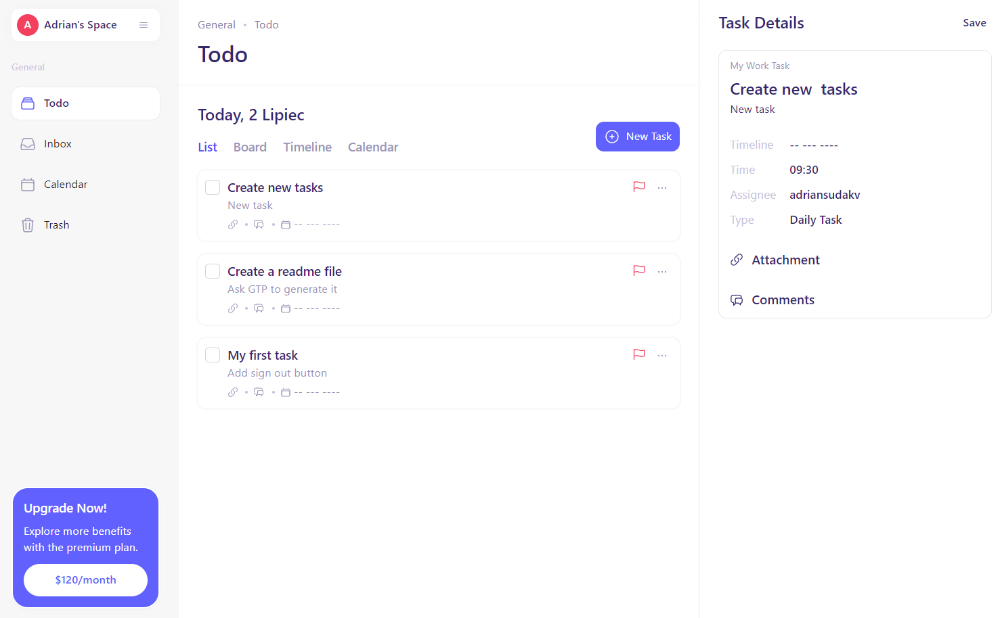

# ToDo App

Welcome to the ToDo App, a task management application built using Vite, React, TypeScript for the frontend, and Django with Python for the backend. This application allows users to create, edit, delete, and manage their tasks through a user-friendly interface. It includes user authentication and authorization to ensure that only authorized users can access and use the app.

## Features

- **User Authentication and Authorization:** Secure login and registration functionality using JWT tokens stored in local storage.
- **Task Management:** Add, edit, and delete tasks with ease.
- **Responsive Design:** An aesthetically pleasing and responsive user interface.
- **Database Integration:** Uses SQLite for database management.
- **Backend:** Built with Django in Python.
- **Frontend:** Built with Vite, React, and TypeScript.

## Demo



You can find the project repository here: [ToDo App Repository](https://github.com/ThaikoZ/to-do-app)

## Getting Started

Follow the steps below to get the application up and running on your local machine.

### Prerequisites

Ensure you have the following installed:

- Python
- Pipenv
- Node.js and npm

### Installation

1. **Clone the repository:**

   ```sh
   git clone https://github.com/ThaikoZ/to-do-app.git
   cd to-do-app
   ```

2. **Set up the backend:**

   ```sh
   cd backend
   pipenv install
   python manage.py runserver
   ```

3. **Set up the frontend:**

   ```sh
   cd ./frontend
   npm install
   npm run dev
   ```

4. **Access the application:**

   - Frontend: The frontend development server should be running on `http://localhost:5173`.
   - Backend: The backend server should be running on `http://localhost:8000`.

## Project Structure

- **backend:** Contains the Django project files.
- **frontend:** Contains the Vite, React, and TypeScript project files.

### Backend

The backend is a Django application that handles user authentication, task management, and provides APIs for the frontend.

- **Database:** Uses SQLite for simplicity.
- **Authentication:** Utilizes JWT tokens for session management.

### Frontend

The frontend is built with Vite, React, and TypeScript. It provides a responsive and interactive user interface for managing tasks.

- **React Router:** For handling navigation.
- **Context API:** For state management.
- **Tailwind CSS:** For styling the application.

## Configuration

### Environment Variables

There aren't any enviromental variables that you should take care of.

## Usage

### Authentication

- **Registration:** Create a new user account.
- **Login:** Authenticate with existing user credentials.
- **Logout:** Securely end the user session.

### Task Management

- **Add Task:** Create a new task.
- **Edit Task:** Modify an existing task.
- **Delete Task:** Remove a task from the list.
- **View Tasks:** View the list of all tasks.

## Deployment

For deploying the application, you can follow standard procedures for deploying Django and React applications. Ensure that you set the `DEBUG` environment variable to `False` and properly configure your database and other production settings.

## License

This project is licensed under the MIT License.

---

Thank you for checking my ToDo App!
